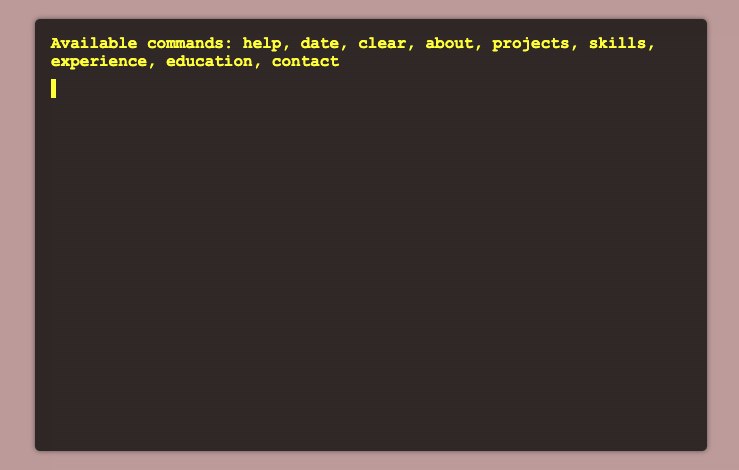

# Retro-Terminal

A simple terminal emulator built with JavaScript.

*Main screen of the Retro-Terminal.*

## Project Structure
<pre>
js/
├─ handlers/
│   ├─ inputHandler.js
│   └─ globalHandlers.js
├─ terminal/
│   ├─ terminal.js
│   └─ cursor.js
├─ utils/
│   ├─ fullscreen.js - later
│   └─ theme.js - later
├─ main.js
└─ init.js
</pre>

### handlers

This folder contains event handlers for user input and global events.

- `inputHandler.js`: Manages user input within the terminal, including handling special keys like Enter, Tab, and arrow keys.
- `globalHandlers.js`: Handles global events like fullscreen toggling.

### terminal

This folder contains the main logic for the terminal emulator.

- `terminal.js`: Handles terminal-related functionality, such as processing commands and animating text.
- `cursor.js`: Manages the terminal cursor, including its position and appearance.

### utils

This folder contains utility functions for various features.

- `fullscreen.js`: Handles toggling the fullscreen mode.
- `theme.js`: Manages theme switching.

### main.js

Contains the main application logic and ties together different modules.

### init.js

Handles the initialization of the application, including adding event listeners and initializing the terminal.

## How to Use

1. Clone the repository to your local machine.
2. Open `index.html` in your browser.
3. Start typing commands in the terminal.

## Available Commands

- `help`: Displays a list of available commands.
- `date`: Displays the current date and time.
- `clear`: Clears the terminal output.

## Features
* Autocomplete: Suggests possible commands as users start typing, similar to real terminals.
* Command history: Users can navigate through their previously entered commands using the arrow keys.
* Customizable appearance: Allows users to customize the terminal's appearance, such as changing the font size, font family, background color, and text color.
* Mobile-friendly: Fully responsive design that works well on mobile devices.
* Typing sound effects: Subtle typing sound effects and animations make the terminal feel more engaging and realistic.

